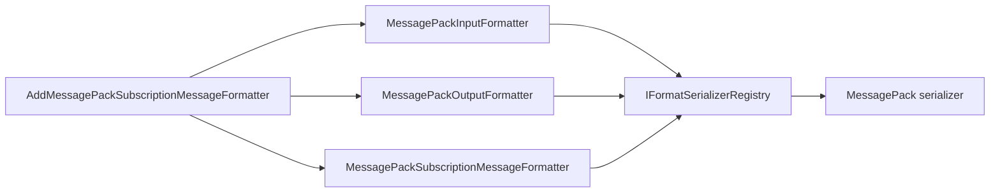

# MessagePack Subscription Message Formatter

## Contents

- [Overview](#overview)
- [Files](#files)
- [Types & Members](#types--members)
- [Serialization & Contracts](#serialization--contracts)
- [Validation & Constraints](#validation--constraints)
- [Performance Notes](#performance-notes)
- [Package Dependencies](#package-dependencies)
- [Diagrams](#diagrams)
- [Examples](#examples)
- [See Also](#see-also)

## Overview

The MessagePack module connects ThunderPropagator subscription messages to the MessagePack serializer. It registers a structured subscription formatter and supplies ASP.NET Core input and output formatters for the `application/x-msgpack` media type. The assembly targets .NET 8, .NET 9, and .NET 10 through shared repository build settings.

## Files

| File | Primary type(s)/symbol(s) | LOC (approx) | Responsibility |
|---|---|---:|---|
| `AssemblyInfo.cs` | Assembly attributes | 6 | Enables preview annotations where required and exposes internals to test proxies. |
| `DependencyInjection.cs` | `DependencyInjection` | 28 | Registers the subscription formatter and MVC formatters. |
| `MessagePackInputFormatter.cs` | `MessagePackInputFormatter` | 6 | Selects MessagePack deserialization for matching HTTP requests. |
| `MessagePackOutputFormatter.cs` | `MessagePackOutputFormatter` | 6 | Selects MessagePack serialization for matching HTTP responses. |
| `MessagePackSubscriptionMessageFormatter.cs` | `MessagePackSubscriptionMessageFormatter` | 13 | Identifies the serializer and content type used for subscription delivery. |
| `ThunderPropagator.SubscriptionMessageFormatters.MessagePack.csproj` | Project manifest | 8 | Declares the ThunderPropagator and MessagePack serializer dependencies. |

[↑ Back to top](#contents)

## Types & Members

| Type | Kind | Summary | Inherits/Implements | Key Members |
|---|---|---|---|---|
| `DependencyInjection` | Static class | Adds all MessagePack subscription and MVC services. | Extension container | `AddMessagePackSubscriptionMessageFormatter` |
| `MessagePackInputFormatter` | Sealed class | Reads `application/x-msgpack` request bodies. | `FormatInputFormatter` | Parameterless constructor |
| `MessagePackOutputFormatter` | Sealed class | Writes `application/x-msgpack` response bodies. | `FormatOutputFormatter` | Parameterless constructor |
| `MessagePackSubscriptionMessageFormatter` | Sealed class | Formats structured subscription messages with MessagePack. | `StructuredSubscriptionMessageFormatter` | `SerializerType`, `ContentType` |

### DependencyInjection

- **Kind:** Static extension class
- **Namespace:** `ThunderPropagator.SubscriptionMessageFormatters.MessagePack`
- **Key method:** `IServiceCollection AddMessagePackSubscriptionMessageFormatter(IServiceCollection services)`
- **Validation:** Rejects a null service collection.
- **Registration behavior:** Uses `TryAddEnumerable` for a singleton `ISubscriptionMessageFormatter`, then appends the matching MVC input and output formatters.
- **Thread-safety:** Registration is intended for single-threaded application startup.

**Usage Recipe**

```csharp
builder.Services
    .AddControllers()
    .Services
    .AddMessagePackSubscriptionMessageFormatter();
```

### MessagePackInputFormatter

- **Kind:** Sealed class
- **Namespace:** `ThunderPropagator.SubscriptionMessageFormatters.MessagePack`
- **Inherits:** `FormatInputFormatter`
- **Constructor:** Configures serializer identity `MessagePack` and media type `application/x-msgpack`.
- **Thread-safety:** Contains no module-owned mutable state; request processing is delegated to the shared base class.
- **Serialization notes:** Resolves the matching deserializer through ThunderPropagator's serializer registry.

**Usage Recipe**

Register the module and declare `application/x-msgpack` as the request content type; ASP.NET Core selects this formatter automatically.

### MessagePackOutputFormatter

- **Kind:** Sealed class
- **Namespace:** `ThunderPropagator.SubscriptionMessageFormatters.MessagePack`
- **Inherits:** `FormatOutputFormatter`
- **Constructor:** Configures serializer identity `MessagePack` and media type `application/x-msgpack`.
- **Thread-safety:** Contains no module-owned mutable state.
- **Serialization notes:** Writes bytes produced by the matching registered serializer.

**Usage Recipe**

Set a controller response content type to `application/x-msgpack` after registering the module.

### MessagePackSubscriptionMessageFormatter

- **Kind:** Sealed class
- **Namespace:** `ThunderPropagator.SubscriptionMessageFormatters.MessagePack`
- **Inherits:** `StructuredSubscriptionMessageFormatter`
- **Constructor:** `MessagePackSubscriptionMessageFormatter(IFormatSerializerRegistry registry)`
- **Key properties:** `SerializerType : SerializerType` identifies MessagePack; `ContentType : string` returns `application/x-msgpack`.
- **Thread-safety:** Depends on the lifetime and guarantees of the injected serializer registry.
- **Serialization notes:** The shared base class performs structured serialization; this type supplies format identity.

**Usage Recipe**

```csharp
var formatter = services.GetServices<ISubscriptionMessageFormatter>()
    .Single(candidate => candidate.ContentType == "application/x-msgpack");
```

[↑ Back to top](#contents)

## Serialization & Contracts

MessagePack is a compact binary representation. String-oriented contracts in the paired serializer use Base64, while the MVC formatters operate on bytes. Both MVC formatters and subscription formatting use the same serializer identity, preventing content negotiation from selecting a codec that disagrees with the subscription contract. Model compatibility and wire representation are governed by the paired format-serializer package.

## Validation & Constraints

- The service collection must not be null.
- The serializer registry must contain the MessagePack serializer before formatting occurs.
- HTTP content negotiation requires the exact `application/x-msgpack` media type.
- Model-level constraints are inherited from MessagePack; unsupported model shapes fail in the serializer layer.

## Performance Notes

The module adds no transformation layer beyond formatter dispatch. Binary payloads avoid text transcoding during HTTP input/output, while the shared formatter base controls buffering and response writes. Reuse the registered singleton subscription formatter instead of constructing formatters per message.

## Package Dependencies

| Package | Version | Description | Links |
|---|---|---|---|
| `ThunderPropagator` | `1.0.1-beta.186` | Core application, serializer registry, subscription formatter abstractions, and ASP.NET Core formatter infrastructure. | [Registry](https://github.com/KiarashMinoo?tab=packages) · [Repository](https://github.com/KiarashMinoo/ThunderPropagator) · [registration](#dependencyinjection) |
| `ThunderPropagator.FormatSerializers.MessagePack` | `1.0.1-beta.4` | MessagePack serializer implementation paired with this adapter. | [Registry](https://github.com/KiarashMinoo?tab=packages) · [Repository](https://github.com/KiarashMinoo/ThunderPropagator.FormatSerializers) · [formatter](#messagepacksubscriptionmessageformatter) |

Both restored manifests identify ThunderPropagator as the author and use the Apache-2.0 license. Package IDs may gain Debug or platform suffixes through shared build configuration.

## Diagrams

### Registration and formatting flow



Registration makes one serializer identity available to subscription delivery and ASP.NET Core content negotiation.

## Examples

```csharp
using ThunderPropagator.SubscriptionMessageFormatters.MessagePack;

builder.Services.AddMessagePackSubscriptionMessageFormatter();

app.MapPost("/messages", (IncomingMessage message) =>
    Results.Content(
        content: "accepted",
        contentType: "application/x-msgpack"));
```

The serializer package must also be available to the shared registry used by the application.

## See Also

- [Documentation hub](../README.md)
- [MessagePack](../MessagePack/README.md)
- [NetJson](../NetJson/README.md)
- [Protobuf](../Protobuf/README.md)
- [Toon](../Toon/README.md)
- [Xml](../Xml/README.md)
- [Yaml](../Yaml/README.md)

[↑ Back to top](#contents)
