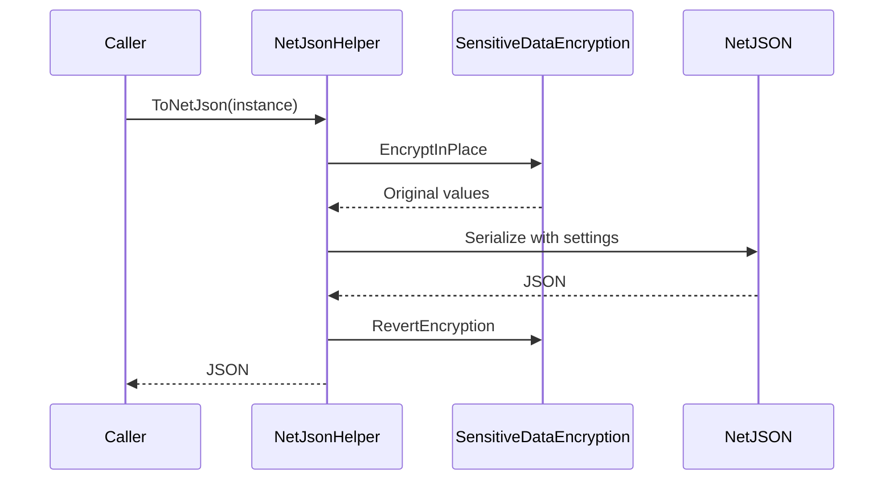
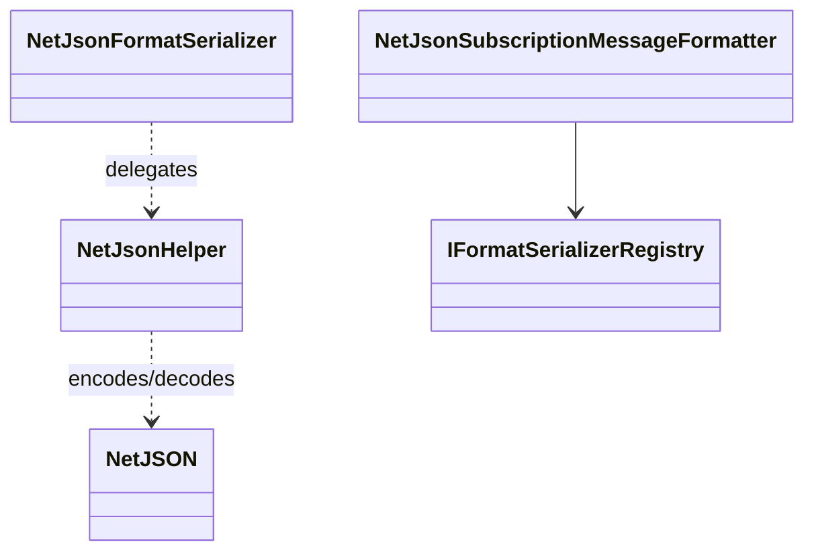

# NetJson Subscription Message Formatter

## Contents

- [Overview](#overview)
- [Files](#files)
- [Types & Members](#types--members)
- [Serialization & Contracts](#serialization--contracts)
- [Validation & Constraints](#validation--constraints)
- [Performance Notes](#performance-notes)
- [Package Dependencies](#package-dependencies)
- [Diagrams](#diagrams)
- [Examples](#examples)
- [See Also](#see-also)

## Overview

The NetJson module provides both a NetJSON-backed serializer/deserializer and a structured subscription-message formatter for `application/json`. Its helper API supports strings, UTF-8 bytes, and Base64, applies ThunderPropagator sensitive-data protection around serialization, and emits tracing activities when telemetry listeners are present. Dependency injection registers the subscription formatter; the serializer itself must be available through the shared registry.

## Files

| File | Primary type(s)/symbol(s) | LOC (approx) | Responsibility |
|---|---|---:|---|
| `AssemblyInfo.cs` | Assembly attributes | 4 | Exposes internals to test proxies and the unit-test assembly. |
| `DependencyInjection.cs` | `DependencyInjection` | 25 | Registers the NetJson subscription formatter. |
| `NetJsonFormatSerializer.cs` | `NetJsonFormatSerializer` | 70 | Implements shared string and byte serialization contracts. |
| `NetJsonHelper.cs` | `NetJsonHelper` | 139 | Provides conversion helpers, settings, telemetry, and sensitive-data handling. |
| `NetJsonSubscriptionMessageFormatter.cs` | `NetJsonSubscriptionMessageFormatter` | 12 | Selects NetJson for structured subscription messages. |
| `ThunderPropagator.SubscriptionMessageFormatters.NetJson.csproj` | Project manifest | 8 | Declares core ThunderPropagator and NetJson serializer dependencies. |

[↑ Back to top](#contents)

## Types & Members

| Type | Kind | Summary | Inherits/Implements | Key Members |
|---|---|---|---|---|
| `DependencyInjection` | Static class | Registers structured NetJson subscription formatting. | Extension container | `AddNetJsonSubscriptionMessageFormatter` |
| `NetJsonFormatSerializer` | Sealed class | Adapts NetJSON to common serializer contracts. | `IFormatSerializer`, `IFormatDeserializer` | `Serialize`, `SerializeToBytes`, `Deserialize` |
| `NetJsonHelper` | Static class | Converts values between objects, JSON, bytes, and Base64. | Extension container | `ToNetJson`, `FromNetJson`, byte/Base64 helpers |
| `NetJsonSubscriptionMessageFormatter` | Sealed class | Selects NetJson for structured message delivery. | `StructuredSubscriptionMessageFormatter` | `SerializerType`, `ContentType` |

### DependencyInjection

- **Kind:** Static extension class
- **Namespace:** `ThunderPropagator.SubscriptionMessageFormatters.NetJson`
- **Key method:** `IServiceCollection AddNetJsonSubscriptionMessageFormatter(IServiceCollection services)`
- **Validation:** Rejects a null service collection.
- **Registration behavior:** Uses `TryAddEnumerable` to add one singleton `ISubscriptionMessageFormatter`.
- **Thread-safety:** Intended for startup configuration.

**Usage Recipe**

```csharp
builder.Services.AddNetJsonSubscriptionMessageFormatter();
```

### NetJsonFormatSerializer

- **Kind:** Sealed class
- **Namespace:** `ThunderPropagator.SubscriptionMessageFormatters.NetJson`
- **Implements:** `IFormatSerializer`, `IFormatDeserializer`
- **Key properties:** `SerializerType` returns serializer ID `3`; `MediaType` returns `application/json`.
- **Key methods:**
  - `string Serialize<T>(T instance)` — serializes through `ToNetJson`.
  - `byte[] SerializeToBytes<T>(T instance)` — returns UTF-8 JSON bytes.
  - `T? Deserialize<T>(string data)` — returns `default` for blank input, otherwise parses JSON.
  - `T? Deserialize<T>(byte[] bytes)` — returns `default` for an empty array, otherwise parses UTF-8 JSON.
- **Thread-safety:** Holds no mutable instance state.
- **Serialization notes:** Each operation starts an internal telemetry activity when listeners exist.

**Usage Recipe**

```csharp
var serializer = new NetJsonFormatSerializer();
var payload = serializer.Serialize(order);
var restored = serializer.Deserialize<Order>(payload);
```

### NetJsonHelper

- **Kind:** Static extension class
- **Namespace:** `ThunderPropagator.SubscriptionMessageFormatters.NetJson`
- **Key methods:**
  - `string ToNetJson<T>(T instance, Func<NetJSONSettings, NetJSONSettings>? settings = null)`
  - `byte[] ToNetJsonBytes<T>(T instance, Func<NetJSONSettings, NetJSONSettings>? settings = null)`
  - `string ToNetJsonBase64<T>(T instance, Func<NetJSONSettings, NetJSONSettings>? settings = null)`
  - `T? FromNetJson<T>(string json, Func<NetJSONSettings, NetJSONSettings>? settings = null)`
  - `object? FromNetJson(string json, Type type, Func<NetJSONSettings, NetJSONSettings>? settings = null)`
  - `T? FromNetJsonBytes<T>(byte[] bytes, Func<NetJSONSettings, NetJSONSettings>? settings = null)`
  - `T? FromNetJsonBase64<T>(string value, Func<NetJSONSettings, NetJSONSettings>? settings = null)`
- **Defaults:** Uses camel-case output unless cached `JsonSerializationAttribute` metadata disables it.
- **Thread-safety:** Methods use local settings and state; shared caches and encryption services define the remaining concurrency guarantees.
- **Serialization notes:** Exceptions are converted to `ExceptionInfo`. Other objects are encrypted in place for serialization and restored in a `finally` block.
- **Validation notes:** Blank byte/Base64 inputs return `default`; malformed Base64 raises `FormatException`.

**Usage Recipe**

```csharp
var json = order.ToNetJson(settings =>
{
    settings.CamelCase = false;
    return settings;
});

var orderCopy = json.FromNetJson<Order>();
```

### NetJsonSubscriptionMessageFormatter

- **Kind:** Sealed class
- **Namespace:** `ThunderPropagator.SubscriptionMessageFormatters.NetJson`
- **Inherits:** `StructuredSubscriptionMessageFormatter`
- **Constructor:** `NetJsonSubscriptionMessageFormatter(IFormatSerializerRegistry registry)`
- **Key properties:** `SerializerType : SerializerType` returns `3`; `ContentType : string` returns `application/json`.
- **Thread-safety:** Relies on the injected registry.
- **Serialization notes:** Delegates message serialization to the registered NetJson serializer.

**Usage Recipe**

Resolve `IEnumerable<ISubscriptionMessageFormatter>` and select the formatter whose `ContentType` is `application/json`.

[↑ Back to top](#contents)

## Serialization & Contracts

NetJson defaults to camel-case serialization. A `JsonSerializationAttribute` with `CamelCase = false` overrides that default for its annotated type. Sensitive values are temporarily encrypted before serialization and restored afterward; deserialized values are decrypted in place.

String, UTF-8 byte, and Base64 APIs represent the same JSON payload. Exception instances follow the shared `ExceptionInfo` contract instead of serializing the runtime exception object directly.

## Validation & Constraints

- Blank strings and empty byte arrays passed through `NetJsonFormatSerializer` return `default`.
- Empty or whitespace byte/Base64 helper inputs return `default`.
- A null byte array is not accepted because the helper reads its `Length`.
- Invalid JSON and invalid Base64 propagate codec exceptions.
- Custom settings callbacks must return a usable `NetJSONSettings` instance.
- Current tests identify a round-trip mismatch: default camel-case output is not restoring populated properties through the matching default deserializer settings.

## Performance Notes

String-to-byte conversion allocates a UTF-8 byte array, and Base64 adds another conversion and approximately one-third payload expansion. Direct string or byte methods avoid unnecessary Base64 work. Sensitive-data protection mutates and then restores the object graph, so callers should avoid concurrent serialization of the same mutable instance.

## Package Dependencies

| Package | Version | Description | Links |
|---|---|---|---|
| `ThunderPropagator` | `1.0.1-beta.186` | Core registry, telemetry, encryption helpers, and subscription formatter abstractions. | [Registry](https://github.com/KiarashMinoo?tab=packages) · [Repository](https://github.com/KiarashMinoo/ThunderPropagator) · [registration](#dependencyinjection) |
| `ThunderPropagator.FormatSerializers.NetJson` | `1.0.1-beta.4` | NetJSON codec package; its restored manifest depends on NetJSON `1.4.5`. | [Registry](https://github.com/KiarashMinoo?tab=packages) · [Repository](https://github.com/KiarashMinoo/ThunderPropagator.FormatSerializers) · [helper API](#netjsonhelper) |

Both restored manifests list ThunderPropagator as author and Apache-2.0 as the license. Debug and platform suffixes can be selected by shared build configuration.

## Diagrams

### Serialization lifecycle



The `finally` path restores sensitive members even when codec serialization fails.

### Module relationships



## Examples

```csharp
using ThunderPropagator.SubscriptionMessageFormatters.NetJson;

builder.Services.AddNetJsonSubscriptionMessageFormatter();

var bytes = order.ToNetJsonBytes();
var base64 = order.ToNetJsonBase64();
var restored = bytes.FromNetJsonBytes<Order>();
```

Prefer the byte API for byte-oriented transports and the string API for JSON-native transports.

## See Also

- [Documentation hub](../README.md)
- [MessagePack](../MessagePack/README.md)
- [Protobuf](../Protobuf/README.md)
- [Toon](../Toon/README.md)
- [Xml](../Xml/README.md)
- [Yaml](../Yaml/README.md)

[↑ Back to top](#contents)
