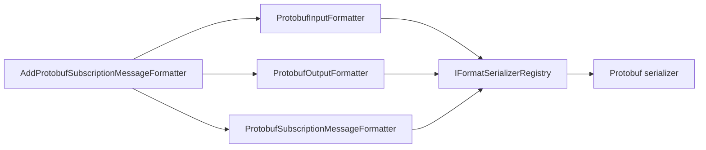

# Protobuf Subscription Message Formatter

## Contents

- [Overview](#overview)
- [Files](#files)
- [Types & Members](#types--members)
- [Serialization & Contracts](#serialization--contracts)
- [Validation & Constraints](#validation--constraints)
- [Performance Notes](#performance-notes)
- [Package Dependencies](#package-dependencies)
- [Diagrams](#diagrams)
- [Examples](#examples)
- [See Also](#see-also)

## Overview

The Protobuf module connects ThunderPropagator subscription messages to the Protocol Buffers serializer. It registers a structured subscription formatter and supplies ASP.NET Core input and output formatters for the `application/x-protobuf` media type. The assembly targets .NET 8, .NET 9, and .NET 10 through shared repository build settings.

## Files

| File | Primary type(s)/symbol(s) | LOC (approx) | Responsibility |
|---|---|---:|---|
| `AssemblyInfo.cs` | Assembly attributes | 6 | Enables preview annotations where required and exposes internals to test proxies. |
| `DependencyInjection.cs` | `DependencyInjection` | 29 | Registers the subscription formatter and MVC formatters. |
| `ProtobufInputFormatter.cs` | `ProtobufInputFormatter` | 6 | Selects Protocol Buffers deserialization for matching HTTP requests. |
| `ProtobufOutputFormatter.cs` | `ProtobufOutputFormatter` | 6 | Selects Protocol Buffers serialization for matching HTTP responses. |
| `ProtobufSubscriptionMessageFormatter.cs` | `ProtobufSubscriptionMessageFormatter` | 13 | Identifies the serializer and content type used for subscription delivery. |
| `ThunderPropagator.SubscriptionMessageFormatters.Protobuf.csproj` | Project manifest | 8 | Declares the ThunderPropagator and Protobuf serializer dependencies. |

[↑ Back to top](#contents)

## Types & Members

| Type | Kind | Summary | Inherits/Implements | Key Members |
|---|---|---|---|---|
| `DependencyInjection` | Static class | Adds all Protobuf subscription and MVC services. | Extension container | `AddProtobufSubscriptionMessageFormatter` |
| `ProtobufInputFormatter` | Sealed class | Reads `application/x-protobuf` request bodies. | `FormatInputFormatter` | Parameterless constructor |
| `ProtobufOutputFormatter` | Sealed class | Writes `application/x-protobuf` response bodies. | `FormatOutputFormatter` | Parameterless constructor |
| `ProtobufSubscriptionMessageFormatter` | Sealed class | Formats structured subscription messages with Protocol Buffers. | `StructuredSubscriptionMessageFormatter` | `SerializerType`, `ContentType` |

### DependencyInjection

- **Kind:** Static extension class
- **Namespace:** `ThunderPropagator.SubscriptionMessageFormatters.Protobuf`
- **Key method:** `IServiceCollection AddProtobufSubscriptionMessageFormatter(IServiceCollection services)`
- **Validation:** Rejects a null service collection.
- **Registration behavior:** Uses `TryAddEnumerable` for a singleton `ISubscriptionMessageFormatter`, then appends the matching MVC input and output formatters.
- **Thread-safety:** Registration is intended for single-threaded application startup.

**Usage Recipe**

```csharp
builder.Services
    .AddControllers()
    .Services
    .AddProtobufSubscriptionMessageFormatter();
```

### ProtobufInputFormatter

- **Kind:** Sealed class
- **Namespace:** `ThunderPropagator.SubscriptionMessageFormatters.Protobuf`
- **Inherits:** `FormatInputFormatter`
- **Constructor:** Configures serializer identity `Protobuf` and media type `application/x-protobuf`.
- **Thread-safety:** Contains no module-owned mutable state; request processing is delegated to the shared base class.
- **Serialization notes:** Resolves the matching deserializer through ThunderPropagator's serializer registry.

**Usage Recipe**

Register the module and declare `application/x-protobuf` as the request content type; ASP.NET Core selects this formatter automatically.

### ProtobufOutputFormatter

- **Kind:** Sealed class
- **Namespace:** `ThunderPropagator.SubscriptionMessageFormatters.Protobuf`
- **Inherits:** `FormatOutputFormatter`
- **Constructor:** Configures serializer identity `Protobuf` and media type `application/x-protobuf`.
- **Thread-safety:** Contains no module-owned mutable state.
- **Serialization notes:** Writes bytes produced by the matching registered serializer.

**Usage Recipe**

Set a controller response content type to `application/x-protobuf` after registering the module.

### ProtobufSubscriptionMessageFormatter

- **Kind:** Sealed class
- **Namespace:** `ThunderPropagator.SubscriptionMessageFormatters.Protobuf`
- **Inherits:** `StructuredSubscriptionMessageFormatter`
- **Constructor:** `ProtobufSubscriptionMessageFormatter(IFormatSerializerRegistry registry)`
- **Key properties:** `SerializerType : SerializerType` identifies Protobuf; `ContentType : string` returns `application/x-protobuf`.
- **Thread-safety:** Depends on the lifetime and guarantees of the injected serializer registry.
- **Serialization notes:** The shared base class performs structured serialization; this type supplies format identity.

**Usage Recipe**

```csharp
var formatter = services.GetServices<ISubscriptionMessageFormatter>()
    .Single(candidate => candidate.ContentType == "application/x-protobuf");
```

[↑ Back to top](#contents)

## Serialization & Contracts

Protocol Buffers is a schema-oriented binary representation. Serializable models must satisfy the protobuf-net contract conventions used by the paired serializer. Both MVC formatters and subscription formatting use the same serializer identity, preventing content negotiation from selecting a codec that disagrees with the subscription contract. Model compatibility and wire representation are governed by the paired format-serializer package.

## Validation & Constraints

- The service collection must not be null.
- The serializer registry must contain the Protobuf serializer before formatting occurs.
- HTTP content negotiation requires the exact `application/x-protobuf` media type.
- Model-level constraints are inherited from Protocol Buffers; unsupported model shapes fail in the serializer layer.

## Performance Notes

The module adds no transformation layer beyond formatter dispatch. Binary payloads avoid text transcoding during HTTP input/output, while the shared formatter base controls buffering and response writes. Reuse the registered singleton subscription formatter instead of constructing formatters per message.

## Package Dependencies

| Package | Version | Description | Links |
|---|---|---|---|
| `ThunderPropagator` | `1.0.1-beta.186` | Core application, serializer registry, subscription formatter abstractions, and ASP.NET Core formatter infrastructure. | [Registry](https://github.com/KiarashMinoo?tab=packages) · [Repository](https://github.com/KiarashMinoo/ThunderPropagator) · [registration](#dependencyinjection) |
| `ThunderPropagator.FormatSerializers.Protobuf` | `1.0.1-beta.4` | Protocol Buffers serializer implementation paired with this adapter. | [Registry](https://github.com/KiarashMinoo?tab=packages) · [Repository](https://github.com/KiarashMinoo/ThunderPropagator.FormatSerializers) · [formatter](#protobufsubscriptionmessageformatter) |

Both restored manifests identify ThunderPropagator as the author and use the Apache-2.0 license. Package IDs may gain Debug or platform suffixes through shared build configuration.

## Diagrams

### Registration and formatting flow



Registration makes one serializer identity available to subscription delivery and ASP.NET Core content negotiation.

## Examples

```csharp
using ThunderPropagator.SubscriptionMessageFormatters.Protobuf;

builder.Services.AddProtobufSubscriptionMessageFormatter();

app.MapPost("/messages", (IncomingMessage message) =>
    Results.Content(
        content: "accepted",
        contentType: "application/x-protobuf"));
```

The serializer package must also be available to the shared registry used by the application.

## See Also

- [Documentation hub](../README.md)
- [MessagePack](../MessagePack/README.md)
- [NetJson](../NetJson/README.md)
- [Protobuf](../Protobuf/README.md)
- [Toon](../Toon/README.md)
- [Xml](../Xml/README.md)
- [Yaml](../Yaml/README.md)

[↑ Back to top](#contents)
