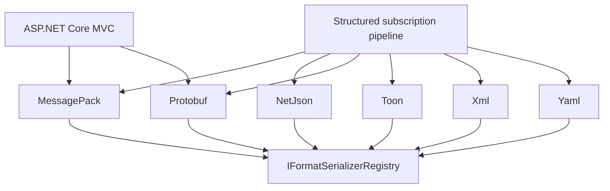

# Subscription Message Formatters Documentation

## Contents

- [Overview](#overview)
- [Areas](#areas)
- [Format Comparison](#format-comparison)
- [Architecture](#architecture)
- [Package Dependencies](#package-dependencies)
- [Build and Verification](#build-and-verification)
- [Coverage Audit](#coverage-audit)

## Overview

This documentation covers the six .NET adapters that connect ThunderPropagator's serializer registry to structured subscription-message delivery. MessagePack and Protobuf also integrate with ASP.NET Core content negotiation through input and output formatters. All projects use centrally managed package versions and target .NET 8, .NET 9, and .NET 10.

## Areas

| Area | Public types | Files | Purpose |
|---|---:|---:|---|
| [MessagePack](./MessagePack/README.md) | 4 | 6 | Binary subscription and MVC formatting with MessagePack. |
| [NetJson](./NetJson/README.md) | 4 | 6 | JSON helpers, serializer contracts, and subscription formatting. |
| [Protobuf](./Protobuf/README.md) | 4 | 6 | Binary subscription and MVC formatting with Protocol Buffers. |
| [Toon](./Toon/README.md) | 2 | 4 | Text-oriented TOON subscription formatting. |
| [Xml](./Xml/README.md) | 2 | 4 | XML subscription formatting. |
| [Yaml](./Yaml/README.md) | 2 | 4 | YAML subscription formatting. |

## Format Comparison

| Module | Content type | Subscription formatter | MVC input/output | Representation |
|---|---|---|---|---|
| MessagePack | `application/x-msgpack` | Yes | Yes | Binary |
| NetJson | `application/json` | Yes | No | UTF-8 JSON; optional Base64 helper |
| Protobuf | `application/x-protobuf` | Yes | Yes | Binary |
| Toon | `text/toon` | Yes | No | Text |
| Xml | `application/xml` | Yes | No | Text |
| Yaml | `application/yaml` | Yes | No | Text |

Choose the format according to the consuming transport and model contract. MessagePack and Protobuf are suited to compact binary HTTP bodies, while the remaining modules expose subscription-delivery adapters around their paired serializer packages.

## Architecture

### Repository modules



Each module is an independently referenceable assembly. Architecture tests enforce that sibling formatter assemblies do not depend on one another.

[↑ Back to top](#contents)

## Package Dependencies

| Package | Version | Used by | Description | Links |
|---|---|---|---|---|
| `ThunderPropagator` | `1.0.1-beta.186` | All modules | Core subscription pipeline, serializer registry, and MVC formatter infrastructure. | [Registry](https://github.com/KiarashMinoo?tab=packages) · [Repository](https://github.com/KiarashMinoo/ThunderPropagator) |
| `ThunderPropagator.FormatSerializers.MessagePack` | `1.0.1-beta.4` | [MessagePack](./MessagePack/README.md#package-dependencies) | MessagePack serializer integration. | [Registry](https://github.com/KiarashMinoo?tab=packages) · [Repository](https://github.com/KiarashMinoo/ThunderPropagator.FormatSerializers) |
| `ThunderPropagator.FormatSerializers.NetJson` | `1.0.1-beta.4` | [NetJson](./NetJson/README.md#package-dependencies) | NetJSON serializer integration. | [Registry](https://github.com/KiarashMinoo?tab=packages) · [Repository](https://github.com/KiarashMinoo/ThunderPropagator.FormatSerializers) |
| `ThunderPropagator.FormatSerializers.Protobuf` | `1.0.1-beta.4` | [Protobuf](./Protobuf/README.md#package-dependencies) | protobuf-net serializer integration. | [Registry](https://github.com/KiarashMinoo?tab=packages) · [Repository](https://github.com/KiarashMinoo/ThunderPropagator.FormatSerializers) |
| `ThunderPropagator.FormatSerializers.Toon` | `1.0.1-beta.4` | [Toon](./Toon/README.md#package-dependencies) | ToonNet serializer integration. | [Registry](https://github.com/KiarashMinoo?tab=packages) · [Repository](https://github.com/KiarashMinoo/ThunderPropagator.FormatSerializers) |
| `ThunderPropagator.FormatSerializers.Xml` | `1.0.1-beta.4` | [Xml](./Xml/README.md#package-dependencies) | XML serializer integration. | [Registry](https://github.com/KiarashMinoo?tab=packages) · [Repository](https://github.com/KiarashMinoo/ThunderPropagator.FormatSerializers) |
| `ThunderPropagator.FormatSerializers.Yaml` | `1.0.1-beta.4` | [Yaml](./Yaml/README.md#package-dependencies) | YamlDotNet serializer integration. | [Registry](https://github.com/KiarashMinoo?tab=packages) · [Repository](https://github.com/KiarashMinoo/ThunderPropagator.FormatSerializers) |

The restored manifests identify ThunderPropagator as author and Apache-2.0 as the license. No repository `NuGet.Config` exists; the shared ThunderPropagator packages require the organization's GitHub Packages feed when they are not already cached.

## Build and Verification

Configure the package source once, substituting credentials with package-read access:

```powershell
dotnet nuget add source https://nuget.pkg.github.com/KiarashMinoo/index.json --name github --username YOUR_GITHUB_USERNAME --password YOUR_GITHUB_PAT --store-password-in-clear-text
```

Restore and build the detected .NET stack:

```powershell
dotnet restore ThunderPropagator.SubscriptionMessageFormatters.slnx
dotnet build ThunderPropagator.SubscriptionMessageFormatters.slnx -c Release --no-restore
dotnet test ThunderPropagator.SubscriptionMessageFormatters.slnx -c Release --no-build
```

## Coverage Audit

| Traversed folder | Canonical document | Required sections | Diagrams | Retry pass | Status |
|---|---|---|---|---:|---|
| MessagePack source module | [MessagePack](./MessagePack/README.md) | Present | Mermaid | 1 | ✅ |
| NetJson source module | [NetJson](./NetJson/README.md) | Present | Mermaid | 1 | ✅ |
| Protobuf source module | [Protobuf](./Protobuf/README.md) | Present | Mermaid | 1 | ✅ |
| Toon source module | [Toon](./Toon/README.md) | Present | Mermaid | 1 | ✅ |
| Xml source module | [Xml](./Xml/README.md) | Present | Mermaid | 1 | ✅ |
| Yaml source module | [Yaml](./Yaml/README.md) | Present | Mermaid | 1 | ✅ |

- Excluded test projects and build/cache directories according to the prompt.
- Dropped the leading source-root segment and stripped the common project prefix.
- No canonical-path collisions or heuristic-only documents were produced.
- All generated folder READMEs contain substantive API details and at least one Mermaid diagram.

[↑ Back to top](#contents)
