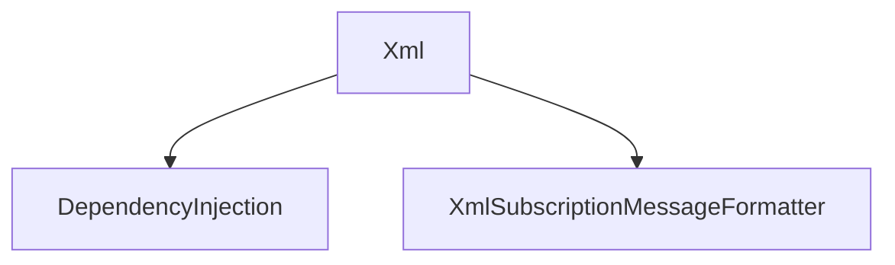

# Xml

## Contents

- [Overview](#overview)
- [Files](#files)
- [Types and Members](#types-and-members)
- [Serialization and Contracts](#serialization-and-contracts)
- [Validation and Constraints](#validation-and-constraints)
- [Diagrams](#diagrams)
- [Examples](#examples)
- [See Also](#see-also)

## Overview

The **Xml** area groups 2 documented types, including `DependencyInjection`, `XmlSubscriptionMessageFormatter`. It provides the contracts and implementation used by this part of ThunderPropagator.SubscriptionMessageFormatters.

## Files

| File | Primary type(s)/symbol(s) | LOC (approx.) | Responsibility |
|---|---|---:|---|
| `AssemblyInfo.cs` | — | 4 | Contains the assembly info implementation or configuration. |
| `DependencyInjection.cs` | `DependencyInjection` | 23 | Defines DependencyInjection and its related behavior. |
| `ThunderPropagator.SubscriptionMessageFormatters.Xml.csproj` | — | 8 | Defines project build targets, dependencies, and package metadata. |
| `XmlSubscriptionMessageFormatter.cs` | `XmlSubscriptionMessageFormatter` | 12 | Defines XmlSubscriptionMessageFormatter and its related behavior. |

## Types and Members

| Type | Kind | Summary | Inherits/Implements | Key Members |
|---|---|---|---|---|
| [`DependencyInjection`](#dependencyinjection) | class | Extension methods for registering ThunderPropagator BuildingBlocks services. | — | `AddXmlSubscriptionMessageFormatter(…)` |
| [`XmlSubscriptionMessageFormatter`](#xmlsubscriptionmessageformatter) | class | Represents the XmlSubscriptionMessageFormatter class. | — | `SerializerType`, `ContentType` |

### DependencyInjection

- **Kind:** class
- **Namespace:** `ThunderPropagator.SubscriptionMessageFormatters.Xml`
- **Inherits/implements:** None declared
- **Attributes:** None detected
- **Key members:** `AddXmlSubscriptionMessageFormatter(…)`
- **Summary:** Extension methods for registering ThunderPropagator BuildingBlocks services.
- **Thread safety:** Follow the lifetime and concurrency guarantees of the owning component; no additional guarantee is inferred.

**Usage recipe**

```csharp
// Resolve DependencyInjection from the configured service container or construct it with its declared dependencies.
```

[↑ Back to top](#contents)

### XmlSubscriptionMessageFormatter

- **Kind:** class
- **Namespace:** `ThunderPropagator.SubscriptionMessageFormatters.Xml`
- **Inherits/implements:** None declared
- **Attributes:** None detected
- **Key members:** `SerializerType`, `ContentType`
- **Summary:** Represents the XmlSubscriptionMessageFormatter class.
- **Thread safety:** Follow the lifetime and concurrency guarantees of the owning component; no additional guarantee is inferred.

**Usage recipe**

```csharp
// Resolve XmlSubscriptionMessageFormatter from the configured service container or construct it with its declared dependencies.
```

[↑ Back to top](#contents)

## Serialization and Contracts

Serialization behavior is part of the public wire or persistence contract in this area. Preserve field names, ordering rules, content negotiation, and backward-compatibility expectations when changing these types.

## Validation and Constraints

Inputs are validated at component boundaries. Callers should provide non-null required values and handle domain or argument exceptions without retrying invalid requests unchanged.

## Diagrams

### Component overview



The diagram shows the direct components documented by the **Xml** area.

## Examples

Start with `DependencyInjection` as the primary entry point for this folder, then follow its linked contracts and collaborators.

## See Also

- [Documentation home](../README.md)
- [MessagePack](../MessagePack/README.md)
- [NetJson](../NetJson/README.md)
- [Protobuf](../Protobuf/README.md)
- [Toon](../Toon/README.md)
- [Yaml](../Yaml/README.md)

[↑ Back to top](#contents)
