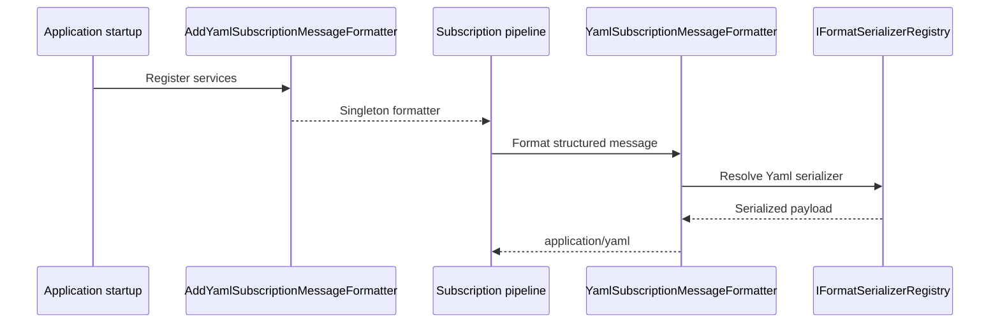

# Yaml Subscription Message Formatter

## Contents

- [Overview](#overview)
- [Files](#files)
- [Types & Members](#types--members)
- [Serialization & Contracts](#serialization--contracts)
- [Validation & Constraints](#validation--constraints)
- [Performance Notes](#performance-notes)
- [Package Dependencies](#package-dependencies)
- [Diagrams](#diagrams)
- [Examples](#examples)
- [See Also](#see-also)

## Overview

The Yaml module adds YAML support to ThunderPropagator's structured subscription-message pipeline. It contributes a singleton `ISubscriptionMessageFormatter` that advertises `application/yaml` and delegates serialization through the shared registry. Unlike the binary HTTP adapters, this module does not add ASP.NET Core MVC input or output formatters.

## Files

| File | Primary type(s)/symbol(s) | LOC (approx) | Responsibility |
|---|---|---:|---|
| `AssemblyInfo.cs` | Assembly attributes | 4 | Exposes internals to test proxies and the unit-test assembly. |
| `DependencyInjection.cs` | `DependencyInjection` | 25 | Registers the Yaml subscription-message formatter. |
| `YamlSubscriptionMessageFormatter.cs` | `YamlSubscriptionMessageFormatter` | 13 | Supplies the serializer identity and content type. |
| `ThunderPropagator.SubscriptionMessageFormatters.Yaml.csproj` | Project manifest | 8 | Declares core ThunderPropagator and Yaml serializer dependencies. |

## Types & Members

| Type | Kind | Summary | Inherits/Implements | Key Members |
|---|---|---|---|---|
| `DependencyInjection` | Static class | Registers Yaml subscription formatting. | Extension container | `AddYamlSubscriptionMessageFormatter` |
| `YamlSubscriptionMessageFormatter` | Sealed class | Connects structured messages to the YAML serializer. | `StructuredSubscriptionMessageFormatter` | `SerializerType`, `ContentType` |

### DependencyInjection

- **Kind:** Static extension class
- **Namespace:** `ThunderPropagator.SubscriptionMessageFormatters.Yaml`
- **Key method:** `IServiceCollection AddYamlSubscriptionMessageFormatter(IServiceCollection services)`
- **Validation:** Throws when the service collection is null.
- **Registration behavior:** Adds one singleton implementation of `ISubscriptionMessageFormatter` with `TryAddEnumerable`.
- **Thread-safety:** Intended for application startup; no mutable module state is retained.

**Usage Recipe**

```csharp
builder.Services.AddYamlSubscriptionMessageFormatter();
```

### YamlSubscriptionMessageFormatter

- **Kind:** Sealed class
- **Namespace:** `ThunderPropagator.SubscriptionMessageFormatters.Yaml`
- **Inherits:** `StructuredSubscriptionMessageFormatter`
- **Constructor:** `YamlSubscriptionMessageFormatter(IFormatSerializerRegistry registry)`
- **Key properties:** `SerializerType : SerializerType` returns the Yaml serializer identifier; `ContentType : string` returns `application/yaml`.
- **Thread-safety:** Relies on the injected registry and serializer implementation.
- **Serialization notes:** The formatter delegates YAML mapping and scalar handling to `YamlFormatSerializer`; YAML schema behavior is defined by the paired serializer.
- **Validation notes:** No model validation is added by the adapter.

**Usage Recipe**

```csharp
var formatter = serviceProvider
    .GetServices<ISubscriptionMessageFormatter>()
    .Single(candidate => candidate.ContentType == "application/yaml");
```

[↑ Back to top](#contents)

## Serialization & Contracts

The formatter delegates YAML mapping and scalar handling to `YamlFormatSerializer`; YAML schema behavior is defined by the paired serializer. The shared `StructuredSubscriptionMessageFormatter` controls message handling, while this adapter fixes the serializer identity and media type used on the wire.

## Validation & Constraints

- The service collection and serializer registry are required.
- The paired Yaml serializer must be registered in `IFormatSerializerRegistry`.
- Producers and consumers must agree on `application/yaml`.
- Codec-specific model rules remain the responsibility of the format-serializer package.

## Performance Notes

The adapter performs constant-time format selection and adds no additional payload transformation. Runtime cost is dominated by YAML serialization and any transport buffering performed by the shared subscription pipeline.

## Package Dependencies

| Package | Version | Description | Links |
|---|---|---|---|
| `ThunderPropagator` | `1.0.1-beta.186` | Core registry and structured subscription-message abstractions. | [Registry](https://github.com/KiarashMinoo?tab=packages) · [Repository](https://github.com/KiarashMinoo/ThunderPropagator) · [registration](#dependencyinjection) |
| `ThunderPropagator.FormatSerializers.Yaml` | `1.0.1-beta.4` | YAML serializer used by this adapter. | [Registry](https://github.com/KiarashMinoo?tab=packages) · [Repository](https://github.com/KiarashMinoo/ThunderPropagator.FormatSerializers) · [formatter](#yamlsubscriptionmessageformatter) |

The restored package manifests list ThunderPropagator as author and Apache-2.0 as the license. Shared build properties may select Debug or platform-suffixed package IDs.

## Diagrams

### Subscription formatting flow



The adapter is selected by content type and delegates encoding to the registered Yaml serializer.

## Examples

```csharp
using ThunderPropagator.SubscriptionMessageFormatters.Yaml;

builder.Services.AddYamlSubscriptionMessageFormatter();

var candidates = app.Services.GetServices<ISubscriptionMessageFormatter>();
var yaml = candidates.Single(
    formatter => formatter.ContentType == "application/yaml");
```

## See Also

- [Documentation hub](../README.md)
- [MessagePack](../MessagePack/README.md)
- [NetJson](../NetJson/README.md)
- [Protobuf](../Protobuf/README.md)
- [Toon](../Toon/README.md)
- [Xml](../Xml/README.md)
- [Yaml](../Yaml/README.md)

[↑ Back to top](#contents)
